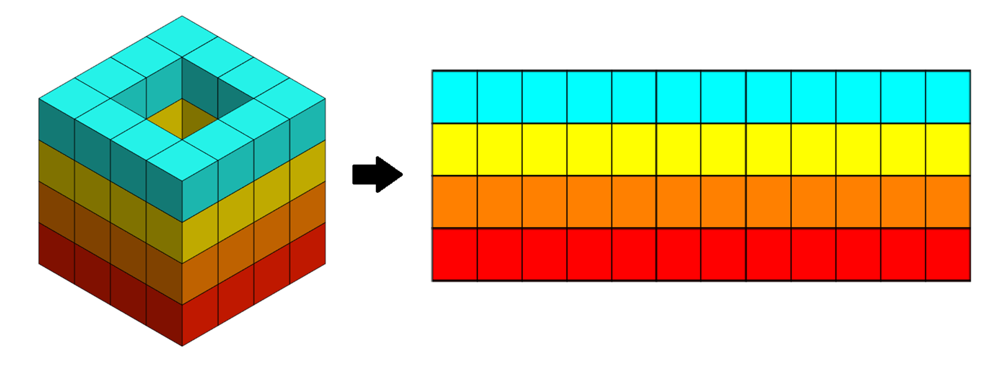

% Exploration vs exploitation - Investigating the effect of novelty on procedural content generation (still dont like title)
% Ben Hutchings
# Abstract
\newpage
#  Introduction

Procedural content generation (PCG) is a technique used in video game design and other creative fields, such as art and music. The technique allows creators to generate a near infinite amount of content based on a few rules, constraints, and parameters. This allows games to be highly replayable, feeling more unique and unpredictable. An example of effective PCG is in No Man’s Sky [@no_man_sky_2016], a universe exploration game, which can generate $2^{64}$ ($~18*10^{18}$) worlds, each ~203 km$^2$ [@newhouse_2016]. Compared to one the biggest non-generated games, ARMA 3 [@arma_3_2012], which has a map size of 270 km$^2$ [@carlson_2013], shows how much more content can be generated by PCG.

PCG does come with some downsides, mainly sacrificing quality control. A traditional game would have game designers’ hand-designing all aspects of the game, meaning the output is predetermined and easily controllable. Since PCG is designed to be unending, it is impossible to completely quality check. Unlike other types of PCG, like art and music, the design of content in games is first and foremost based around playability, with artistic qualities being a secondary objective. Many existing machine learning PCG techniques allow for small variations in the content generated, which in a medium like music makes no difference to the overall quality, but small variations in game design can lead to the game being unplayable. But playability is not a binary scale, as [@koster_2013] explains, there exists a "golden section" of game design which is the perfect balance novelty and familiarity, which is pleasing for our brains and therefore better to play.

Another drawback to PCG is processing costs and generation speed. According to the steam hardware survey [@steam_2023], which is the most comprehensive hardware census and continuously updated, there is still a massive range in hardware capabilities being used, with strongest graphics card being ~2400% stronger than the weakest [@userbenchmark]. The higher the hardware requirements for a game, the larger the proportion of users unable to run the game, alienating a portion of the customer base.

An approach to PCG is using machine learning. Outside of games, machine learning based PCG has made massive leaps forward. Models such as DALL-E 2 [@ramesh2022hierarchical] can generate completely unique photo-realistic images from a text description, and ChatGPT [@chatgpt_2022] can generate text answers to almost any question. These models have been so successful due in large part to the enormous amount of data they have been trained on and the huge complexity of the models, which presents problems for PCG in games. For DALL-E/ChatGPT to generate whatever is requested, they needed to have seen something similar to base their response off of. This is problematic for game world generation, as there exists no dataset big or diverse enough to adequately train these models [@summerville2018procedural]. Large-scale deep learning models are also extremely computationally expensive, heavily affecting the hardware requirements.

Another issue is the idea of creativity. Models such as DALL-E and ChatGPT do produce unique outputs, but the output is based on many existing sources. For these models this is not a big problem because of the huge variety of training data which allows the models to draw on many sources to generate new content [@ibmai_2015]. Games on the other hand generally have the same recognizable styles and artifacts throughout the world. A model splicing these together could lead to a disjointed world and recognizable from other games, leading to lower immersion. 

The fundamental problem with PCG is the the *state-explosion* problem, where as the size of the generated content increases, the search space increases exponentially and brute force solutions become intractable [@Godefroid_2002]. Since it is impossible to verify if a solution is the best solution, an approximate solution is required. One approach to this is through the use of genetic algorithms (GA). GA’s take inspiration from the biological process of natural selection and use it to evolve a solution to a problem, using heuristics to guide a population towards a solution. Evolving a solution instead of training from past solutions comes with certain advantages. By having an algorithm which is controlled by the rules of a system rather than being trained on existing examples allows the model to come up with new unique solutions, rather than rehashing existing solutions.

This paper will be experimenting with NEAT [@6790655], which is a type of genetic algorithm, and how the performance is affected by different levels of novelty. I will be investigating this within the context of the EvoCraft [@grbic2020evocraft] challenge, a PCG challenge for MineCraft [@persson_2023]. Theses concepts will be explained in more detail.

## Aims and Objectives
Aim: Investigate how varying levels of novelty affects the (quality, realism??) of procedurally generated cities in Minecraft
Objectives:
    1. Investigate other competition entries for the EvoCraft challenge
    2. Research procedural content and novelty search techniques
    3. Implement fitness functions to evaluate single structures
    4. Experiment with varying levels of novelty
    5. Evaluate multi-structure cities to see effects of novelty

# Background
## Minecraft
Minecraft is a 3D, open-world, sandbox, voxel-based video game. Each voxel, called a block, can be broken and replaced to build structures, allowing players to apply their creativity. Minecraft uses PCG and world seeds to create a unique world which is 3.6 billion blocks$^2$ [@whitworth_2021], allowing players virtually infinite space to explore and build. Because of the open-ended nature of the game and the simplicity of interactions with the world, Minecraft has become a platform for many AI challenges, including mineRL. This competition focused on an agent within Minecraft which has to complete a variety of tasks in an unknown environment. Because there is no one defined task, the algorithm has to be able to complete many smaller problems, with the eventual goal of improving research into general intelligence. 

For interactions between Python and Minecraft world I will be using a Minecraft server with a Bukkit [@bukkit_2010] plugin called RaspberryJuice installed and the McPi Python library to communicate with it. Bukkit is a server modification tool with an API which allows users to easily create server plugins. The plugin converts Python commands into Java commands which can be processed by the Minecraft server. The McPi simply sends Python commands to the RaspberryJuice plugin.

### EvoCraft
To investigate genetic algorithms for PCG, I am working on the EvoCraft Challenge. The EvoCraft challenge brief is to create an open-ended algorithm which is capable of creating novel and increasingly complex structures in MineCraft. These algorithms have to be unending and should aim to diverge over time rather than slow down and become repetitive. One of the drawbacks of PGC was the lack of quality control, and the problem with infinitely generating content becoming repetitive over time. This challenge aims to use evolving algorithms to keep generating content which keeps diverging and becoming more interesting.

## Other EvoCraft Entries 
### Evocraft PCGNN
[@beukman2023hierarchically] were came runners up in the EvoCraft competition with their endless city generator. Their approach broke a city down into the component 'levels', starting from the lowest level, the house and garden. To generate a house and garden they broke this down into 4 components: the house structure, roof, decorations, and garden. They then used a PCGNN (Procedural Content Generation using Neat and Novelty search) approach to generate each of these components. The house, roof, and decorations are all generated as 3d tilemaps to be placed in-world. The house consists of walls, empty space, and entrance, the roof consists of a design covering the area beneath it, and the decorations consists of decoration blocks filling floor space inside the house. The garden works slightly differently as it is a 2d tilemap covering an area with flowers, grass, and trees. They then used these component houses and gardens to create a town. A town is its own generated 2D tilemap of houses, gardens and roads @@image in appendix@@, where are road connects all the houses in the town. They then placed many towns together to create a city, which could grow endlessly. 
@@pic in appendix@@  

### simple_minecraft_evolver 
[@real-itu_2021] 
The simple Minecraft evolver is basic NEAT implementation which aims to build a tower towards a gold block in the air. Early generations start by building towers in random directions, but as they evolve they move more towards the gold block. This model is simple because of how the fitness is calculated. @@finish

## Neural Networks
A neural network is a type of machine learning technique which is modelled after the human brain. A neural network consists of neurons, shown in figure @@. Each neuron has a weighted connection to other neurons, a bias, and an activation function. 
$$y=f(\sum_{i=0}^n w_{i}x_{i}+b)$$ (Equation for neuron output) 
$w$: input weights from previous neurons $x$: input values from previous neurons $b$: bias
  Sigmoid activation function: $$f(x)=\frac{1}{(1+e^{-x})}$$
Shown is the the sigmoid activation function as an example, but many different activation functions exist. In a neural network many of these neurons are fully connected together to create a network of neurons, an example shown in @@figure. A typical neural network has an input layer, some hidden layers, and an output layer. To make a prediction from a neural network, some input values are given to the input layer neurons and those values are used to calculate the values in the next layer, then the next, until reaching the output layer. 

## NEAT + Novely Search
NeuroEvolution of Augmenting Topologies (NEAT) is type of genetic algorithm (GA) which heavily mimics biological evolution to increase the complexity of neural networks. NEAT uses a direct encoding method where all nodes, weights, and biases from each individual are all encoded into a "genome", which can be used to recreate the neural network (the phenotype). To begin many individuals created, called a population. These initial individuals have no hidden nodes and are just weighted connections between the input and output nodes. Each individual is evaluated using a fitness function and given a fitness score. The top individuals with the highest fitness score are taken and used to create a new population. 
To create a new population the individuals undergo "crossover". This is where two genomes are combined to create an "offspring" by randomly combining their genomes together. This process is not done blindly though, as this is much more likely to create a non-functioning neural network rather than improving the performance. To crossover two genomes they first have to share a similar enough genome to allow them to crossover. This is done by recording each network's evolution history and if the genomes share a similar enough history then they can crossover. Once offspring have been created through crossover, they undergo mutation. Mutation is the process of making random changes to an individual's genome, which can show as new nodes or changes to weights in the phenotype. The aim of NEAT is, through random mutation and crossover, to evolve (make random changes) a solution to a problem [@heidenreich_2019].         

There is however a problem with this evolution process, a population's fitness score can easily become stuck in a local maxima. This comes from a deeper ideological difference between biological evolution and genetic algorithms. The purpose of an GA is to reach a global maximum fitness, whereas biological evolution aims to both evolve fit individuals which will survive, but will also spread out and diverse over generations. If a species does not diversify then it is more vulnerable to diseases and sudden changes to the environment [@Greenwald_2009]. For an GA to get out of a local maxima it must first drop in fitness score before finding another genome structure which would allow it to reach the global maxima. Traditional GA algorithms don't allows for this as any drop in fitness score would kill the individual and stop it from evolving further. Here we take a note from biological evolution and promote diversity, called novelty search. Novelty search gives a higher fitness to individuals which have significantly changed from the population. This lets individuals change and explore the search space without being killed, leading to a higher probability of success. [@6790655]

## Reinforcement Learning PCG
Reinforcement learning (RL) is a type of machine learning composed of three key elements: an agent, the environment, a reward. RL uses a trial-and-error method with an agent interacting with an environment. An agent makes an action within and environment and will either be rewarded, if the the action was a positive action, and punished, if the action was negative. The eventual goal for a RL agent is to learn a policy, which is a mapping from input states to output actions. The agent starts with random actions and getting experience, in the form of state-action-reward, which is used to update the policy of the agent. Eventually the agent aims to maximize the cumulative reward signal by maintaining a balance between exploring, to learn new experiences, and exploitation, leveraging existing techniques.

RL gains many of the same benefits as genetic algorithms. Just like GA's, RL's require no large dataset and therefore don't have any of the intrinsic biases and creativity issues which come with it. There are some subtle differences between the two algorithms. RL can sometimes suffer trying to reach a global maxima in reward/fitness. Because RL is one agent learning over many iterations, if the agent chooses a strategy which works well, but only reaches a local maxima, it would have to unlearn that entire strategy and come up with a new one for it to reach a global maxima. A GA on the other hand has many individuals in a population, each which can explore their own routes (promoted through novelty search). Each route that ends in a local maxima will be killed in favour of a route which produces a global maxima, therefore having a higher likelihood of reaching the global maxima [@joy_2019]. While the RL model approach has the potential to be effective in this project, the properties of NEAT make it more desirable. 

## General Adveserial Networks 
A General Adversarial Network (GAN) is type of deep learning network, composed of two neural networks: A generator and discriminator. The role of a generator is, once trained on the training data, to generate more examples which resemble the training data. The role of the discriminator is to tell the difference between examples from the training data and the examples generated by the generator [@Park_2022]. A common analogy for this the relationship between an art forger and art appraiser. The appraiser ensures that only the most convincing art forgeries survive and sell art, improving the quality of the forged art. 

GAN's have some powerful advantages which make them very powerful in certain situations. Since the training data is only used for examples, there is no need to label the data. Once a GAN is fully trained, both parts of the network can be used. A well trained generator can create very realistic and unique creative works, in many different styles. DALLE-2, a realistic image generator, uses a GAN-like network structure to create unique photo-realistic images. The discriminator can also be used to detecting abnormalities, for example medical imaging, quality control, and fraud detection. There are some issues with GAN's. They require vast amounts of training data and the wider the range of outputs being generated, the higher the size of the training data required. They are also a black box and very hard to reason why it came up with what it did, making it very hard to fix problems like diversity of output and garbled data. GAN's naturally lose detail from the input to the output, which makes the generated content lose some finer details [@hui_2018]. This is not a problem for creative works as some minor variation has no affect on the quality of the output, but does have an effect on PCG for games. Some minor changes to game generation can leave it unplayable and useless. The combination of not being able to generate at a very fine level, being a black box, and requiring huge amounts of training data, it can be very hard to reliable produce quality controlled content like games. Because of these disadvantages a GAN approach is unsuitable for this project.

# Implementation
I have chosen to do this project in Python. While the competitors (Java, C++, R...) are much faster than the core Python modules, there are libraries, such as NumPy, which are written in C and are extremely quick. This means it can perform well on large datasets, making it a favorite for data scientists. Because it is a popular data science language, there is also a large collection of machine learning libraries supported to help development.

As previously mentioned, I will be experimenting with novelty in NEAT populations to create structures in MineCraft. I am taking a note from [@beukman2023hierarchically] and breaking down the solution into 2 models, one to produce the base of the structure (called the house model) and the other to create the roof. This each approach can be broken down into three main objectives: genome creation, the fitness functions, and novelty experimentation.

Initially the house model predicted a 3D cube and the fitness functions promoted models with the correct structure (e.g. leaving airspace inside and a 1 block thick wall) . The issue with this is predicting a 3D model is very computationally expensive and it took many generations to get the correct structure. Given the walls always follow this structure it should have to predict this, rather than learn to. Another approach is mapping the external wall of the 3D cube to a 2D tilemap, and predicting the 2D tilemap. An example of this is shown in figure@@. The advantages of this approach is it is much more computationally efficient and because the model is only predicting the external blocks, it cannot build an incorrect building structure. The disadvantages of this is it limits the model to a 1 block exterior wall, but this is acceptable for the simple structures the model will create.

The roof model, similar to the house model, initially predicted a 3D roof model but had the same issues as the house model. The other approach to this is very similar to the house model. Since the roof should be one block thick and cover the area underneath, it can be shown as a 2D tilemap describing the height of each block in the roof. An example of a heightmap is shown in @@figure. An issue is that the model predicts the block height of each point on the tilemap, it doesn't predict the type of block to place, therefore an algorithmic solution will have to be used to find which blocks to use.   

## Genome creation
A genome is an individual within a population. It contains the information needed to create a neural network, which can be used to create structures. The aim is to create a genome which, given some configuration information (building dimensions, type of blocks...), can output a structure which follows the configuration instructions. To implement the NEAT algorithms, I am using the python library called neat-python [@McIntyre_neat-python]. This library manages the encoding and mutation of the population, the only implementation that is required is giving the evolution hyperparameters and evaluating the fitness of each individual.

### Evolution hyperparameters
Hyperparameters are the parameters which control the learning process for each population, such as mutation rate and network activation functions. One of these parameters is the input/output sizes of the genomes, which must be a fixed value for all individuals in a population at all times. The simplest way to use a genome to create a structure is to map each output neuron to a block to be placed in the structure. The disadvantage of this strategy is that since the output size is fixed, the size of the structure must be fixed, which limits the possible creativity and could easily become boring. A different strategy is to have the output not be a whole structure, but one block in the structure, and run the model many times. Using this technique the output size of the genome is each block possible to place. The genome will then choose the most likely block that should be placed, denoted ŷ. Unfortunately MineCraft contains over 1050 blocks/items, many of which cannot be placed or are dependant on other blocks around it, and there is no list of all structural blocks. Therefore I went through each blocks and made a list of each block which can be placed, which came out to 133 blocks.
Both house and roof model approach the generation in a similar way, predicting each block (ŷ) in a 2D tilemap. To do this the models are given the overall size of the structure to be generated, the current position of ŷ, and the 8 blocks surrounding ŷ (denoted $x_{surr}$). An example of ŷ and $x_{surr}$ are shown in @@figure. The input is padded with -1's so that when $x_{surr}$ is gathered at the edges there are always values to collect. Since the house model is also generating blocks, there needs to be some control over the blocks placed. Therefore the model is also given 3 seed blocks which should be used significantly in the structure.

## Fitness Functions
A fitness function is used to evaluate the quality of a candidate solution, to help it reach the desired solution. According to [@mallawaarachchi_2017] a fitness function should be:  
- Clearly defined: it should be easy to understand and provide meaningful insight into the performance.
- Intuitive: Better solutions should get a better score and visa-versa 
- Efficiently implemented: NEAT requires many generations to evolve a good solution, so the fitness function should not be a bottleneck
- Sensitive: Should be able to distinguish between slightly better and slightly worse solutions to allow a gradual movement towards a better solution
For each model the fitness is calculated by combining the novelty score and structure score (explained in more detail below). The ratio of these combinations decides the level of novelty in the population. 

### Structure Scoring
#### House Model 
To start calculating a house score, the components of the desired structure have to be broken down. When deciding fitness functions it is important to limit the scope of what can be expected, there is always more detail that can be added to the scoring. The purpose of the scoring is to highlight the important parts of a structure and guide the genome towards the desired output, but leaving enough flexibility to allow for creativity. A balance between control and creativity. Each of the component scoring functions generate a value between $0<x<1$ and the average is used to calculate the final overall score.
The fitness functions I decided on were:
1. A bounding wall
An important part of a house is a complete wall with no air-gaps. While the wall cannot be structurally wrong, the model can still place airgaps which must be minimised. The score is calculated by taking the percentage of blocks that aren't air.
2. A door
There should be a door on ground level to enter the structure. This is the only score which is either 0 (no usable door) or 1 (usable door).
3. Seed blocks
The 3 seed blocks inputs are to control the types of blocks which are generated by the structure. This scores models higher which prioritise using blocks from the three seed blocks given. For each seed block which is in the top 5 blocks used, 1/3 is added to the score. 
4. Symmetry
In almost everything considered beautiful, there is some element of symmetry. It has been well documented that humans find symmetry much more attractive and soothing to look at [@Huang_2018]. Instead of limiting my model and forcing symmetry in one axis, I am checking both x & y axes and chosing the one which has the highest symmetry. The symmetry is calculated by comparing the percentage of equal blocks on both sides of the axis, giving a value between 0 and 1. 

#### Roof Model
Since this is a simple structure with a lower search space, it is very easy for the fitness functions to be too controlling. For example, if the scores maximize for sloped rooves, then only sloped rooves will be generated, therefore it was very important to have gentle control.
The scores I decided on were:
1. Compliance
This ensures the heightmap generated fits within the limits I have set. For example, if the maximum height set is 5 blocks and the heightmap contains a height greater than 5, then the solution doesn't pass the compliance check. This fitness is either a 0 (failed the check) or 1 (passed the check). 
2. Symmetry
Just like the house model, I am maximizing for symmetry in the xy axes.
3. Visual Complexity
This is the fitness for quality checking and making the solution more interesting. To make the solutions more interesting I am maximizing for complexity in the surface. This is achieved by rewarding changes in height over flatness. This is accomplished by counting the ratio of changes in height of 1 vs no changes in height. I am purposely not counting changes in height of more than 1, as that will leave gaps and ruin the look of the roof. An example of low complexity vs high complexity is shown in @@figure. I chose this solution over rewarding specific types of structure, like flat or triangle-sloped rooves, to allow for more flexibility. 

### Novelty Scoring
A novelty score encapsulates how much an individual in a new generation has changed from the previous generation. A higher novelty score means an individual has significantly changed from the previous generation, leading to a higher fitness score. The hope of this is for individuals to be able to make changes to their genotypes which may not improve the structure score in the short term, but will lead to long term improvements. In populations with a high novelty score to structure score ratio, the individuals will be able to spread out try more novel solutions without being killed. If novelty is too high then the structure score becomes less and less important, leading to the solutions being novel but useless. The model still has to enforce the structure scores.

When finding the novelty of a genome, it needs to be compared to its closest relations. If a genomes if very different to its closest relations, then it will have a high novelty score. If there are two genomes which are completely different then they will always have a high novelty score, regardless of the changes made to the genomes. The easiest way to compare a genome to the closest relations is by taking the average novelty between the *k*-nearest-neighbours (KNN). To improve the novelty score, a new genome can also be compared to the previous generation by archiving them. A novelty score is then composed of the comparison between neighbours and archived ancestors. To promote the highest novelty, only individuals above a threshold, $ρ_x$, are added to the archive. From some simple testing, $ρ_x = 0.85$ archived the right amount of the highest novelty genomes. 

#### Dynamic Novelty
One issue with a fixed level of novelty is that it is not always suitable for every situation. When a population is stuck in a local minimum a very high novelty ratio is needed to help promote potential solutions which move the the population out of the local minimum. On the other hand when the population is quickly improving, a low novelty ratio is needed to promote the individuals which are improving the most. Having a high novelty ratio in this circumstance is not bad but increases the number of generations needed converge to a solution. An improvement to this is a dynamic novelty system which looks at how quickly a population is improving and adjusts the novelty accordingly. To get the speed of improvement, the gradient of *n*-previous generations structure score's are taken and the inverse is used to calculate the novelty required. After some brief testing I found 15 previous generations gave a good gradient window. If the gradient has been very low for 15 generations then high novelty is required. Any larger window lost convergence speed benefit of dynamic novelty over large novelty. Any smaller window was too vulnerable to randomness.

## Multi-structure constructions
Part of the aim of the project was to use procedural content generation to generate multistructure content, e.g. a city. To generate multiple structures, a trained house and roof population will be taken. Individuals from the populations are randomly selected to place a house and roof. By using all individuals  from the population, the novelty of a population can come across in the constructions.
@@How multietructures are calculated

# Evaluation
## Experimentation
The aim of the experimentation is to understand the effects of different levels of novelty in populations for building structures. When an individual's fitness is calculated, their structure and novelty scores are calculated and the ratio of these are used for the fitness. The ratio of structure:novelty determines the level of novelty in the population. To experiment with the novelty, different populations will be trained, each with a different level of novelty. The structure scores throughout training will be collected and compared to show the effects of novelty throughout the training process. For each level of novelty a house and roof model will be trained twice. Since the models are inherantly random, running the generations multiple times was necessary to show a population wasn't an anomoly. The levels of novelty that will be compared are: no novelty (control), low novelty (1:4 novelty:structure), high novelty (4:1 novelty:structure), full novelty (1:0 novelty:structure), and the dynamic novelty approach. 
Each house model trained had a population of 20 and each roof model trained had a population of 100. Having a larger population increases the chances of a positive mutation, but also increases the hardware requirements. The neat-python library does not have GPU support and can struggle at larger populations, so was limited to those population sizes. Each model was trained for 2000 generations and was then trained for longer if the population was still improving.

@@talk about multistructure stuff

# Future Work
- Due to hardware requirements and time pressure I could only run the models twice
- work on other structures
# References